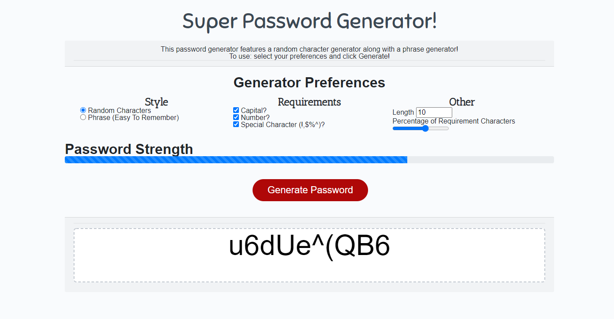

---

# Super-Password-Generator

### [Click Here To use ](https://sakiskid.github.io/Super-Password-Generator/)

#### **8/6/2020** 

## Features

* Two Styles of Password Generation!
* Support for Capital, Number, and Special Character requirements!
* Percentage of special characters as well as password length.

###### Noteworthy:

* GUI instead of Prompts / Alerts
* Will always generate at least 1 of the requirement characters.
* Password Strength (needs to be refined)
* Fast, Performant generation
* Locked number input for length, preventing anything outside of given range.

## Execution:

##### Concerning Loops and Percentage Looping

I initially wanted to loop through the generated password to double check that all of the requirements (capitals, special characters, numbers) were there.

I realized that logging the index of the requirement when they are added to the password and then making sure that they haven't been generated over would be a faster solution (albeit harder to program).

However, I ended up going with a MUCH simpler solution. I had an *aha!* moment, and realized that **if I just had a array of empty indexes**, I could remove the index each time a special character was placed.  

*I am very proud of the way I handled making sure the requirements were in the password! This method was the 3rd iteration of me creating the 'ensurePasswordContainsRequirements' function. This was the computationally fastest method I could think of!*

##### The String Problem

During this I found out that strings are immutable (very frustrating, there is no error log when trying to change an immutable string!) and had to create a workaround using substring. The generator now ALWAYS has 1 of the requirement you ask for; it never overwrites a req with another req.

### Things I learned

* A lot of methods which reference a function also call the function for some reason...

For example, this would call the function:

``` js
generateBtn.addEventListener("click", initializeGeneration());
```

This would not:

``` js
generateBtn.addEventListener("click", function() {
    initializeGeneration();
});
```

* I had a problem with an undefined error when choosing a new letter for my character style generator. It was hard to debug! I realized that just running it step by step into a calculator was the best way to figure out the issue, and I soon realized that I was counting up to 27 letters instead of 26.

* Strings are immutable, who would have thought. To fix this I need to create a temporary new string, then assign the main string to the temp.

* Writing out the math/logic in my head **REALLY HELPS**! I was having a hard time juggling all of the logic for the percentage function, and I ended up writing a lot of my thoughts into comments. That really helped my ADHD brain get centered and created easy references for me... I solved it almost immediately after!

* I learned that I should update these READMEs as I go along, it's easy to forget everything I've worked on...
